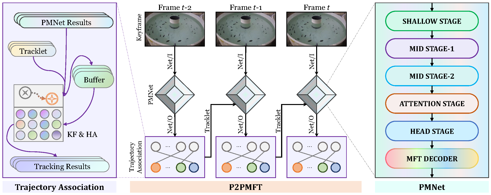
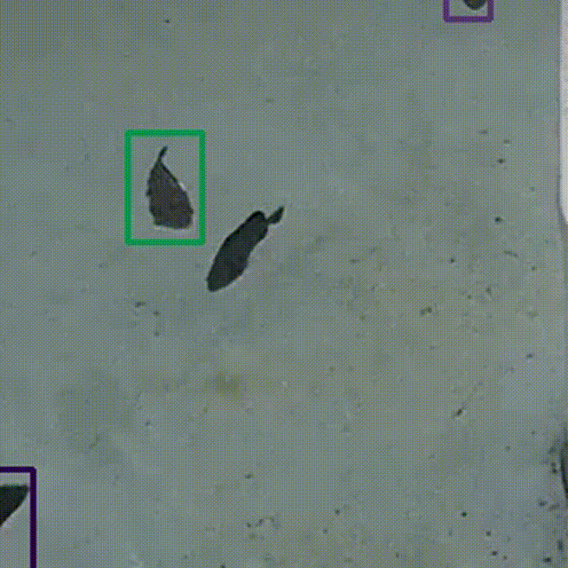
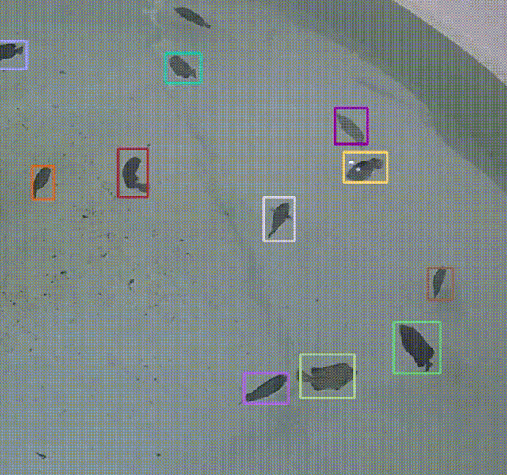

# P2PMFT: Point-to-Point Multiple Fish Tracking
The official implementation of the paper：
>  [**P2PMFT: Point-to-Point Multiple Fish Tracking**](##TODO:LINK##)  
>  Weiran Li, Yeqiang Liu, Zhenbo Li*
>  [**\[Paper\]**](##TODO:LINK##) [**\[Code\]**](https://github.com/vranlee/P2PMFT/)




Contact: vranlee@cau.edu.cn. Any questions or discussion are welcome!

-----

## Updates
+ [2024.07.22] We have initialized the repo. The related resources will be released after the manuscript is accepted.
-----

<!-- ## Tracking Result Samples
 -->

## Abstract
Fish tracking presents greater challenges compared to typical tracking tasks involving pedestrians, vehicles, or dancers, etc. Conventional trackers often struggle to capture the distinctive visual features of fish targets and are deficient in stably identifying them amidst high-frequency deformations. In this paper, we propose a Point-to-Point constrained pipeline for Multiple Fish Tracking, termed P2PMFT, which includes dual backbones. Specifically, the pipeline is designed following a joint-detection and embedding paradigm and accommodates both a re-engineered tracking baseline PMNet and a lightweight baseline PMNetLight. The proposed association mechanism P2PIoU is employed both in multi-task training and ID association in a simple and online manner. The proposed P2PMFT is verified as state-of-the-art on the MFT24 dataset with highest 3.20 IMT scores and 30.4 IDF1 scores, respectively.

## Contributions
+ We propose a fish tracking pipeline P2PMFT based on point-to-point strategy, leveraging the JDE paradigm with embedded density map regression to achieve latency-accuracy trade-off.
+ We design two baseline networks: 1) PMNet, a hybrid CNN-Transformer architecture for high-precision ES; 2) PMNet-Light, a lightweight CNN attention architecture for mobile device applications. This caters to the diverse needs of various application scenarios.
+ We introduce a P2P iterative tracking strategy for minimalistic fish ID matching. This strategy effectively stabilizes fish ID identification and handles ID switches caused by fish occlusions and indistinguishable appearance.
+ We validate the effectiveness of our pipeline on the MFT24 dataset, achieving state-of-the-art performance in both 3.20 IMT and 30.4% IDF1 metrics. These results demonstrate the superior capabilities of P2PMFT in addressing the challenges of missed detections and ID
switches, particularly in the context of fish tracking.

## Tracking Performance

### State-of-the-art Methods Comparsion on MFT Dataset (VER.24)

Method  | Paradigm | IMT ↑ | Method  | Paradigm | IMT ↑ | Method  | Paradigm | IMT ↑ |
---------|----------|--------|---------|----------|--------|---------|----------|--------|
SORT   | SDE | 1.67 |   TransCenter   | TranF | 0.45 | CenterTrack   | JDE | 0.54 |
DeepSORT   | SDE | 1.09 |  TrackFormer   | TranF | 0.46 | FairMOT   | JDE | 1.55 |
Trackor   | SDE |  0.85  | **TFMFT**  | **TranF** | **1.22** | CMFTNet   | JDE | 1.70 |
ByteTrack   | SDE | 0.83 | | | | **P2PMFT**   | **JDE** | **3.20** |
**QDTrack**   | **SDE** | **1.68** | | | | **P2PMFT**   | **JDE** | **1.74** |
OC-SORT   | SDE | 1.01 |

### MFT series Datasets
The dataset have been released on [**\[GitHub|MFT_DATASETS\]**](https://github.com/vranlee/MFT_DATASETS/).

## Installation
+ **Step.1** Clone this repo.
+ **Step.2** Install dependencies. We use **python=3.8.0** and **pytorch=1.7.0**.
   ```
   cd {Repo_ROOT}
   conda env create -f requirements.yaml
   conda activate p2pmft
   ```

## Pretrained Model
Our pretrained models can be downloaded here:   
+  **PMNet.pth [[BaiduYun: m47m]](https://pan.baidu.com/s/16ZC0IHXCfjFzWGoUAx_Tgw?pwd=m47m)**
+  **PMNet_light.pth [[BaiduYun: w3qr]](https://pan.baidu.com/s/1r_uZazts2-KD8gVh4X9iYw?pwd=w3qr)**

## Exps.
* Download or utilize your training datasets.
* Train and Val shell in the experiments/demo.sh:
```
sh experiments/demo.sh
```

## Acknowledgement
A large part of the code is borrowed from [FairMOT](https://github.com/ifzhang/FairMOT), [ByteTrack](https://github.com/ifzhang/ByteTrack), [CountingMOT](https://github.com/weihong9/CountingMOT). Thanks for their wonderful works!

## Citation
The related resources will be released after the manuscript is accepted. You can look up our other repos for MFT resources: [**\[MFT_DATASETS\]**](https://github.com/vranlee/MFT_DATASETS/) [**\[CMFTNet\]**](https://github.com/vranlee/CMFTNet/) [**\[TFMFT\]**](https://github.com/vranlee/TFMFT/).
