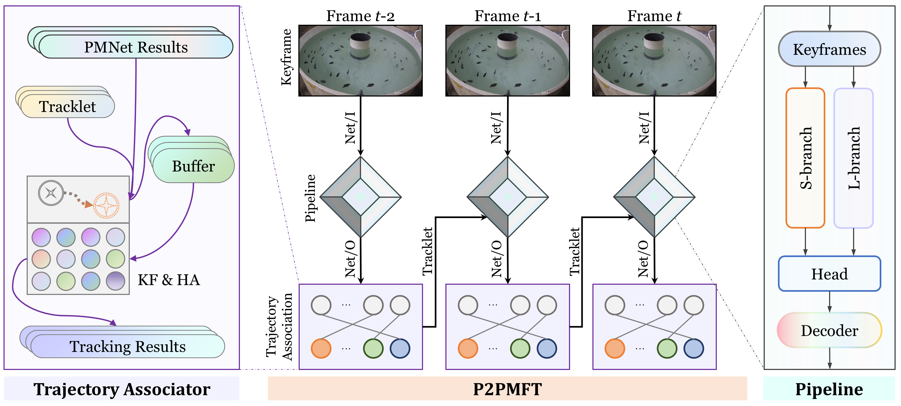

# Simpler and Stronger: A Dual-branch Framework for Multiple Fish Tracking
The official implementation of the paper：
>  [**Simpler and Stronger: A Dual-branch Framework for Multiple Fish Tracking**](##TODO:LINK##)  
>  Weiran Li, Yeqiang Liu, Yiying Sheng, Enyu Yang, Hwa Liang Leo, Zhenbo Li*
>  [**\[Paper\]**](##TODO:LINK##) [**\[Code\]**](https://github.com/vranlee/P2PMFT/)

<div align="center">



</div>

<div align="center">
   
</div>


Contact: vranlee@cau.edu.cn or weiranli@u.nus.edu. Any questions or discussion are welcome!

-----

## Updates
+ [2025.05.17] We have rebuilt the repo and updated the relevant resources.
+ [2024.07.22] We have initialized the repo.
-----

<!-- ## Tracking Result Samples
 -->

## Abstract
Fish tracking presents unique challenges distinct from traditional tracking tasks involving pedestrians or vehicles. Fish often lack distinctive visual features and exhibit rapid morphological changes during swimming, making them difficult to track accurately using conventional methods. This paper introduces P2PMFT (Point-to-Point Multiple Fish Tracking), a novel dual-branch framework specifically designed for fish tracking. The framework integrates a hybrid feature extractor and a trajectory associator, leveraging density map regression to enhance tracking robustness. The dual-branch extractor includes a lightweight branch tailored for real-time, resource-constrained applications and a scalable branch optimized for high-accuracy analysis. Additionally, we propose a two-stage, efficient P2PIoU association mechanism that enhances tracking stability while minimizing computational overhead, excelling in both multi-task training and online ID association. P2PMFT achieves state-of-the-art performance with a HOTA score of 28.43 and the lowest computational cost of 20.47G FLOPs, reducing computation by up to 38.7x compared to existing methods.

## Contributions
+ We propose a fish tracking framework P2PMFT based on point-to-point strategy, with embedded density map regression to achieve latency-accuracy trade-off. The P2PMFT including a dual-branch network to accommodate different application scenarios.
+ We introduce a P2PIoU module for minimalistic fish ID matching. This strategy effectively stabilizes fish ID identification and handles ID switches caused by fish occlusions and indistinguishable appearance.
+ We validate the effectiveness of our framework on the MFT24 dataset, achieving state-of-the-art performance of 28.43 HOTA while compressing the computational complexity by up to 38.7 times that of other methods.

## Tracking Performance

### State-of-the-art Methods Comparsion on MFT Dataset (VER.24)

| **Methods**          | **Params ↓** | **FLOPs ↓** | **HOTA ↑** | **IDF1 ↑** | **IDP ↑** | **IDR ↑** | **DetRe ↑** | **DetPr ↑** | **IDs ↓** | **MOTA ↑** | **MOTP ↑** |
|-----------------------|--------------|-------------|------------|------------|-----------|-----------|-------------|-------------|-----------|------------|------------|
| SORT†          | 99.00M       | 793.21G     | 22.73      | 23.91      | 29.09     | 20.29     | 44.66       | 64.03       | 2599      | 48.67      | 72.01      |
| ByteTrack†     | 99.00M       | 793.21G     | 19.18      | 19.37      | 26.11     | 15.40     | 35.66       | 60.46       | 2325      | 40.17      | 67.99      |
| OC-SORT†       | 99.00M       | 793.21G     | 22.99      | 24.14      | 29.28     | 20.54     | 44.84       | 63.92       | 2674      | 48.44      | 72.17      |
| HybridSORT†    | 99.00M       | 793.21G     | 15.89      | 17.29      | **56.77** | 10.20     | 11.79       | 65.58       | **214**   | 14.23      | 71.64      |
| QDTrack              | 57.20M       | 32.02G      | 25.27      | 24.49      | 27.74     | 21.93     | **53.70**   | 67.92       | 9103      | 42.81      | 75.34      |
| FairMOT              | 16.55M       | 72.93G      | 27.26      | 29.68      | 36.56     | 24.98     | 46.71       | **68.36**   | 2456      | 60.74      | 69.59      |
| CMFTNet              | 45.08M       | 137.77G     | 27.08      | 29.93      | 36.35     | 25.43     | 47.52       | 67.93       | 2716      | **61.90**  | 69.47      |
| TrackFormer          | 42.95M       | 143.43G     | 26.51      | 26.73      | 35.69     | 21.36     | 42.04       | 70.23       | 899       | 43.42      | **76.00**  |
| CenterTrack          | 16.67M       | 61.36G      | 22.49      | 23.39      | 30.90     | 18.81     | 35.11       | 57.67       | 1032      | 26.68      | 68.48      |
| TransCenter          | 30.66M       | 133.09G     | 27.20      | 29.48      | 37.05     | 24.48     | 38.22       | 57.85       | 597       | 24.69      | 73.83      |
| TFMFT                | 39.93M       | 215.27G     | 21.88      | 26.74      | 45.55     | 18.92     | 29.72       | 71.54       | 945       | 35.65      | 74.89      |
| **P2PMFT-S (Ours)**  | **5.79M**    | **20.47G**  | 28.43      | 36.29      | 49.44     | 28.67     | 37.34       | 64.41       | 574       | 47.84      | 67.17      |
| **P2PMFT-L (Ours)**  | 32.59M       | 90.13G      | **29.98**  | **39.01**  | 47.87     | **32.92** | 42.86       | 62.32       | 908       | 54.74      | 65.82      |

* † indicates SDE-based methods using shared weights.  
* -S/-L denote P2PMFT with specialized backbone branches.  
* Efficiency metrics, comprehensive metrics, and individual metrics are given from left to right.

### MFT series Datasets
The dataset have been released on [**\[GitHub|MFT_DATASETS\]**](https://github.com/vranlee/MFT_DATASETS/).

## Installation
+ **Step.1** Clone this repo.
+ **Step.2** Install dependencies. We use **python=3.8.0** and **pytorch=1.7.0**.
   ```
   cd {Repo_ROOT}
   conda env create -f requirements.yaml
   conda activate p2pmft
   ```

## Pretrained Model
Our pretrained models can be downloaded here: **[[BaiduYun]](https://pan.baidu.com/s/13GmVd6hYM38xzvnb2Sr83A?pwd=5uap)**

## Exps.
* Download or utilize your training datasets.
* Train and Val shell in the experiments/demo.sh:
```
sh experiments/exp.sh
```

## Acknowledgement
A large part of the code is borrowed from [FairMOT](https://github.com/ifzhang/FairMOT), [ByteTrack](https://github.com/ifzhang/ByteTrack), [CountingMOT](https://github.com/weihong9/CountingMOT). Thanks for their wonderful works!

## Citation
The related resources will be released after the manuscript is accepted. You can look up our other repos for MFT resources: [**\[MFT_DATASETS\]**](https://github.com/vranlee/MFT_DATASETS/) [**\[CMFTNet\]**](https://github.com/vranlee/CMFTNet/) [**\[TFMFT\]**](https://github.com/vranlee/TFMFT/).
